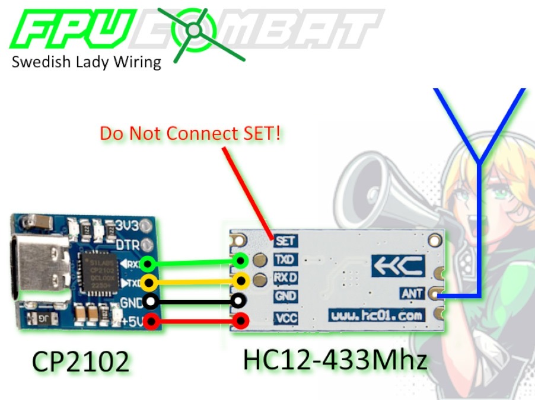

# Your friendly FPV Combat events announcer


## Wiring

For the application to work with the combat system, you need **HC-12 module** (e.g. Hailege HC-12 433Mhz SI4438 Wireless Transceiver) connected to PC via **USB to UART TTL converter** (e.g. CP2102 MICRO USB to UART TTL Convert Module).  
Optionally, install a separate 433mhz antenna to better reception.



## Usage
```
NAME:
   fpvc-lady - FPV Combat Events Announcer

USAGE:
   fpvc-lady [global options] command [command options] 

VERSION:
   0.7.1

COMMANDS:
   help, h  Shows a list of commands or help for one command

GLOBAL OPTIONS:
   --source value       Source of CSP messages: serial, log, demo. (default: "serial") [$SOURCE]
   --serial-port value  Port name where HC12 is connected to; by default the system will try find the port automatically. (default: "auto") [$SERIAL_PORT]
   --http-port value    HTTP server port number (default: 8080) [$HTTP_PORT]
   --log-file value     Path to the log file: save events to (--source serial) or read events from (--source log). (default: "fpvc-lady.log") [$LOG_FILE]
   --log-from value     Datetime to start read events from. Format: YYYY/MM/DD[ HH:mm:SS[.SSSSSS]] [$LOG_FROM]
   --demo-speed value   Number of hits, in average, per minute (default: 10) [$DEMO_SPEED]
   --locale value       Locale to use: de, en, ru, etc. (default: "en")
   --speak value        Text-to-speech command: system, google, none or any other command to convert text to speech. (default: "system") [$SPEAK]
   --speak-lives        Speak lives. (default: false) [$SPEAK_LIVES]
   --speak-cheers       Speak cheers. (default: false) [$SPEAK_CHEERS]
   --help, -h           show help
   --version, -v        print the version
```

### Mac

Macs have male voice by default, use command below to switch to a female voice.
```
fpvc-lady-darwin-amd64-x.x.x --speak "say -v samantha"
```

### Windows

1. Create a folder of your choice - we will use "D:\FPV-COMBAT\lady" in this example
   - place fpvc-lady-windows-amd64-X.X.X.exe in that folder
2. Create a Shortut on your Desktop
   - Target: C:\Windows\System32\WindowsPowerShell\v1.0\powershell.exe -noexit "D:\FPV-COMBAT\lady\fpvc-lady-windows-amd64-0.7.1.exe --serial-port COM3"
     - Exchange **COM3** with the port that your CP2102 module uses when plugged in
     - add arguments according to your needs - refer to global options above
   - Execute in: "D:\FPV-COMBAT\lady\"
3. Replace the standard Icon with our loveley Combat Lady Icon

4. Example for a running the lady in demo mode with cheers, lives, and log file in english
  - Target for shortcut:   C:\Windows\System32\WindowsPowerShell\v1.0\powershell.exe -noexit "D:\FPV-COMBAT\lady\fpvc-lady-windows-amd64-0.7.1.exe --source demo --speak google --speak-cheers --speak-lives --log-file -D:\FPV-COMBAT\lady\LOGS\combat.txt --locale en"

### Linux

On Linux you can either use any offline text-to-speech engine, like "espeak", or use online "google" engine.  
Note: For 'google' engine to work, either mplayer or ffmpeg (ffplay) must be installed.

Examples  

Offline
```
fpvc-lady-linux-amd64-x.x.x --speak espeak
```
Online (requires `mplayer` or `ffplay`)
```
fpvc-lady-linux-amd64-x.x.x --speak google
```
